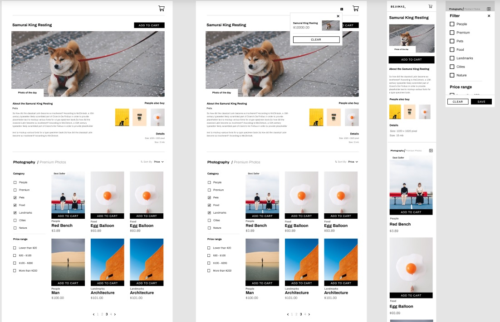

# Prueba Técnica - Maquetación y Funcionalidad - 08-05-2022

## Nos solicitan la realización de una réplica de esta página, con la siguiente funcionalidad:

* Maquetar una sola vista. Responsive.
* Usar componente reutilizables.
* Añadir componentes al carrito.
* Obtener el listado de imágenes de algún sitio.
* Lógica de filtrado y de ordenación.
* Paginación

## Deploy de la aplicación 💻

https://master.d2kk6grb7xi68m.amplifyapp.com/

## Tecnologías utilizadas 🔩

* React
* CSS

## Funcionalidad de la APP 🔨
* FUNCIONALIDAD DE CARRITO DE LA COMPRA
    * Podemos agregar elementos al carrito, pulsando sobre el botón ADD TO CART de cualquiera de las imágenes.
    * Podemos visualizar dicho carrito pulsando en el icono del carro, o bien en el icono de notificación que aparece al tener algún elemento añadido al carro.
    * El carro puede cerrarse con el botón X.
    * El carro puede vaciarse con el botón CLEAR.
* FOTO DEL DÍA
    * La información que aparece sobre la foto del día es tomada directamente de los datos de todas las imágenes (archivo photos.js). Esta foto del día es la imagen con mas ventas. De ella aparece toda su información.
    * Las fotos que aparecen en la sección "People also buy" son las siguientes fotos más vendidas.
* FILTRADO
    * Las fotos pueden filtrarse por categorías y por precios.
    * Si se eligen varios filtros del mismo tipo, se sumarán los resultados de todos los filtros aplicados (p.e. si seleccionamos los filtros "Pets" y "Food" aparecerán todas las fotos con la categoría "Pets", y además todas las fotos con la categoria "Food").
    * Si existen filtros seleccionados de varios tipos, se mostrarán las fotos que contengan ambas características buscadas (p.e. si seleccionamos el filtro "Pets" y el filtro "20 - 100" mostrará todas las imágenes con la categoría "Pets", pero solo las que tengan un precio entre 20 dolares y 100 dolares).
* ORDENACIÓN
    * Los resultados se pueden mostrar ordenados. Si se pulsa el botón de ordenación se ordenarán de manera ascendente, y si se vuelve a pulsar se ordenarán de manera descendente.
    * Con el desplegable de ordenación podemos elegir si ordenar por precio o por nombre.
    * Si se selecciona o se quita cualquier filtro, la ordenación desaparece y habrá que volver a pulsar el botón de ordenación.
* PAGINACIÓN
    * Se muestra el número de páginas totales.
    * Aparece remarcada la página actual.
    * Existen flechas para poder desplazarse entre las diferentes páginas (no se podrá retroceder más allá de la página 1, ni avanzar más allá de la última página).
* RESPONSIVE
    * Ajuste de tamaño de imágenes para diferentes dispositivos.
    * Colocación diferente de varios elementos para poder hacer la visualización más cómoda desde cualquier dispositivo.
* RESPONSIVE (PARTICULARIDADES)
    * IMPORTANTE: LOS SIGUIENTES CAMBIOS SOLO APARECEN SI SE HA CARGADO LA PÁGINA CON UNA PANTALLA DE MENOS DE 768 PIXELES DE ANCHO. SI LA PANTALLA TIENE MAYOR TAMAÑO Y HA SIDO MODIFICADA LA VENTANA DEL NAVEGADOR PARA PODER VISUALIZAR ESTAS PARTICULARIDADES, SERÁ NECESARÍA LA RECARGA DE LA PÁGINA.
    * El botón ADD TO CART localizado en la sección "Photo of the day" se encuentra debajo de la foto.
    * Los filtros desaparecen y aparece en su lugar un botón que hará aparecer una pantalla donde se podrán gestionar dichos filtros.
    * Desaparece la opción de ordenar las fotos.
    * Se muestran 4 fotos por página, en lugar de 6.
